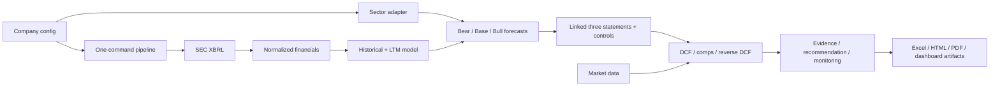

# Institutional Equity Research + Valuation Platform

Turn a company configuration and public filings into normalized financials, linked forecasts, multi-method valuation, market-implied expectations, evidence-backed research, thesis monitoring, and manager-ready reports.

This reusable Python platform is demonstrated end to end on two deliberately different companies: Visa, using a payment-network adapter, and Microsoft, using a software/cloud adapter. Both use the same financial, valuation, controls, research, reporting, dashboard, and export core.

> For research and portfolio demonstration only. Outputs are not investment advice.

## What it solves

Traditional valuation projects are often one-off spreadsheets with manual data movement, hidden assumptions, and weak auditability. This project makes company selection explicit in YAML, isolates outputs by ticker, reconciles a linked three-statement model, retains source lineage, and emits reviewable Excel, HTML, PDF, CSV, and JSON artifacts from one command.

## Architecture



See [docs/architecture.md](docs/architecture.md) for ownership boundaries.

## Feature matrix

| Capability | Visa | Microsoft |
|---|:---:|:---:|
| SEC Company Facts + filing fallback | ✓ | ✓ |
| Annual, quarterly, and LTM normalization | ✓ | ✓ |
| Linked Bear/Base/Bull three statements | ✓ | ✓ |
| Gordon-growth and exit-multiple DCF | ✓ | ✓ |
| Sensitivities, comps, football field, reverse DCF | ✓ | ✓ |
| Evidence-linked recommendation and thesis monitoring | ✓ | ✓ |
| HTML/PDF institutional report and Excel model | ✓ | ✓ |
| Company-scoped workspace and lineage manifest | ✓ | ✓ |
| Sector adapter | Payment network | Software/cloud |
| Disclosed KPI set | Volume, transactions, cross-border, incentives | Cloud, segments, growth, margin, subscribers |

The adapter enriches operating logic; it does not fork the valuation engine. Missing observations stay unavailable rather than being estimated silently.

## Quick start

Requirements: Python 3.10+; macOS or Linux; internet access for live SEC and market data. A respectful SEC user agent is required for filing fallback.

```bash
git clone <repository-url>
cd visa_valuation
python3 -m venv .venv
source .venv/bin/activate
python -m pip install -r requirements.txt
cp .env.example .env
```

Set your own contact string in `.env`; never commit it:

```text
SEC_USER_AGENT=Your Name your.email@example.com
```

Run either complete workflow—no config edits required:

```bash
python src/pipeline.py --config config/company.yaml
python src/pipeline.py --config config/microsoft.yaml
```

Each command prints the company workspace, artifact manifest, Excel model, and report paths when complete. `config/company.yaml` remains the backward-compatible Visa config.

Convenience targets are also available:

```bash
make test
make visa
make microsoft
make demo
make dashboard
```

Override `PYTHON` if needed, for example `make test PYTHON=.venv/bin/python`.

## Portfolio demo

After both company runs, build an artifact-backed side-by-side case study:

```bash
python src/portfolio_demo.py
```

This writes machine-readable JSON plus Markdown and HTML to `docs/demo/`. It reads generated valuation, recommendation, KPI, health, monitoring, report, and lineage artifacts; it does not invent values. Company workspaces under `data/companies/` are ignored by Git by default; review the smaller demo outputs separately if you intend to publish them.

Render the live dashboard with either config:

```bash
streamlit run dashboard/app.py -- --config config/company.yaml
streamlit run dashboard/app.py -- --config config/microsoft.yaml
```

No screenshot is committed because current dashboard values depend on live run artifacts. These commands render the real interface locally.

## Outputs

Every company writes to its own workspace:

```text
data/companies/<ticker>/
├── raw/          SEC facts
├── normalized/   annual, quarterly, LTM, balance sheet
├── derived/      forecasts, WACC, DCF and sensitivities
├── model/        linked statements, checks, Excel workbook
└── research/     comps, intelligence, evidence, recommendation,
                  monitoring, reports and lineage manifest
```

Representative deliverables include:

- `<ticker>_valuation_model.xlsx`: formula-driven model and review workbook
- `<ticker>_investment_report.html` and `.pdf`: investment research report
- `lineage_manifest.json`: artifact inventory and upstream source record
- `recommendation.json`: deterministic rating, rationale, and thresholds
- `evidence_store.json`, `research_claims.json`, `thesis_monitoring.json`
- `scenario_valuation.csv`, `reverse_dcf.csv`, `football_field.csv`

## Configuration

Identity and routing live at the top of each YAML file:

```yaml
ticker: MSFT
company_name: Microsoft Corporation
cik: "0000789019"
adapter: software
storage:
  root: data/companies
```

Configs also contain fiscal calendar, XBRL aliases, peers and multiple eligibility, disclosed KPI observations with source URLs, scenario drivers, WACC and terminal assumptions, recommendation policy, reporting behavior, and thesis-monitoring thresholds. Validation fails early with the exact missing or invalid field path. `config/company.schema.yaml` documents the generic contract.

## Methodology and controls

The pipeline builds annual and quarterly histories, appends LTM, forecasts operating results, links all three statements, derives FCFF, estimates empirical beta and WACC, and values Bear/Base/Bull scenarios. `scenario_valuation.csv` is the canonical Gordon-growth output consumed by the consolidated tables, memo, report, and dashboard. Comparable-company analysis, a football field, and bounded reverse-DCF solvers provide additional lenses. The displayed primary-method central range uses Gordon-growth DCF and the configured direct-peer comp; exit-multiple DCF remains visible as a sensitivity/reference method and is not equally weighted into that central range.

Hard controls include statement reconciliation; cash, debt, PP&E, equity, and retained-earnings roll-forwards; FCFF consistency; scenario ordering; WACC/terminal-growth spread; and terminal-value concentration. Available hard checks must pass before completion. The recommendation policy—not an LLM—sets BUY/HOLD/SELL/WATCH/NO-RATING based on valuation, downside, evidence, thesis confidence, and model health.

Full detail: [docs/methodology.md](docs/methodology.md).

## Testing

```bash
python -m pytest -q
```

Tests cover configuration, fiscal calendars and XBRL aliases, adapters, statement linkage and controls, valuation, research schemas, evidence integrity, reporting, CLI selection, company isolation, manifest refresh, and portfolio-demo generation. End-to-end runs require live external services and are verified separately with both configs.

## Project structure

```text
config/                 Visa and Microsoft public sample configs
dashboard/              Streamlit dashboard
docs/                   architecture, methodology, limitations, case study
src/adapters/            generic, payment-network, software adapters
src/pipeline.py          end-to-end orchestration and CLI
src/portfolio_demo.py    side-by-side artifact-backed demo generator
src/                     ingestion, models, valuation, research, reports, export
tests/                   automated unit and integration tests
data/companies/          generated company-scoped workspaces
Makefile                 common local commands
```

## Security and public-repository hygiene

`.env` and local environments are ignored. `.env.example` contains only a placeholder. Sample configs reference public SEC URLs and environment-variable names; they contain no credentials or private API tokens. Review generated artifacts before publishing because they contain point-in-time market data and absolute paths in legacy report manifests.

## Deployment and use

This repository is a local research pipeline plus a read-only Streamlit presentation layer. Generate and review both company workspaces before deployment; the hosted dashboard should consume those reviewed artifacts rather than rerun SEC and market ingestion on every page load.

Pre-deployment release commands:

```bash
source .venv/bin/activate
python -m pytest -q
python src/pipeline.py --config config/company.yaml
python src/pipeline.py --config config/microsoft.yaml
python src/portfolio_demo.py
python -m streamlit run dashboard/app.py -- --config config/company.yaml
```

For a Microsoft dashboard deployment, set `COMPANY_CONFIG=config/microsoft.yaml`; otherwise the application defaults to Visa. A host must provide Python 3.10+, install `requirements.txt`, make the reviewed `data/companies/<ticker>/` artifacts available through its build or persistent storage (they are intentionally Git-ignored), and start Streamlit with:

```bash
python -m streamlit run dashboard/app.py --server.address 0.0.0.0 --server.port "$PORT"
```

Before making the repository public, inspect generated reports and manifests for point-in-time data and local absolute paths. Do not publish `.env`.

## Known limitations and extensions

Current limitations include dependence on live SEC/market services, issuer taxonomy variation, assumption-driven forecasts, imperfect peers, and unavailable historical valuation percentiles without point-in-time market values. See [docs/limitations.md](docs/limitations.md).

Natural extensions are deployment/CI, additional sector adapters and issuers, point-in-time market-data storage, richer segment forecasting, automated release artifacts, and a recruiter-focused walkthrough/interview-defense package.
