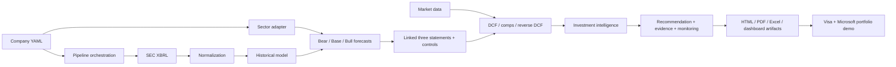

# Architecture

The platform separates company identity and assumptions from reusable financial logic. Each run selects one YAML config and writes only to `data/companies/<ticker>/`.

The shared core owns SEC ingestion, statement linkage, valuation, controls, research schemas, reporting, and workspace routing. Adapters own sector-specific KPI normalization and the operating-driver bridge. A failed optional adapter falls back explicitly to configured top-down growth; it does not silently alter valuation logic.
